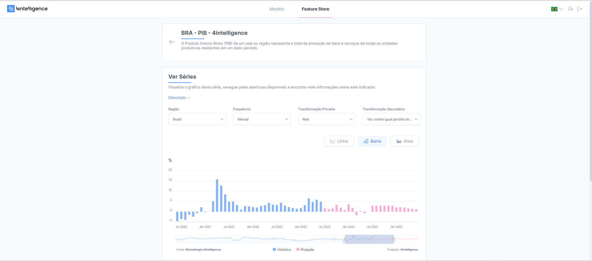

# Organização dos dados da Feature Store

Nessa seção, vamos abordar indicadores, séries e seus componentes. Ao final da leitura você compreenderá a organização dos dados na Feature Store.

## O que são os indicadores?

Cada dado da Feature Store é chamado de indicador. O [Produto Interno Bruto (PIB) com metodologia 4intelligence](https://4casthub.ai/feature-store/indicators/BRGDP0081), por exemplo, é um dos principais indicadores para acompanhar a atividade econômica. Existem diversas informações que podem ser extraídas desse indicador. Podemos acompanhar o crescimento real da economia brasileira ao longo dos anos, comparar o tamanho das economias de estados diferentes ou identificar tendências utilizando a informação sem interferência de padrões sazonais.

## O que são as séries?

As séries são o nível mais detalhado de informação da Feature Store. Cada uma das informações mencionadas acima, como crescimento real da economia brasileira, é uma série. Mais específicamente, são séries temporais, ou seja, um conjunto de observações organizadas em ordem cronológica, com uma observação a cada momento do tempo.

Os gráficos da plataforma que ilustram a evolução dos dados no tempo e as informações que você exporta da plataforma para uma planilha ou envia para um grupo de favoritos são todos séries temporais.

A Feature Store está organizada de modo que as séries são uma combinação de cinco componentes: indicador, região, frequência, transformação primária e transformação secundária. Voltando ao exemplo anterior, para acompanhar o crescimento real da economia brasileira ao longo dos anos, combinamos os seguintes componentes.

-   **Indicador**: BRA - PIB - 4intelligence
-   **Região**: Brasil
-   **Frequência**: Mensal
-   **Transformação Primária**: Real
-   **Transformação Secundária**: Variação contra igual período do ano anterior

## Qual é a informação contida em cada componente de uma série?

**1) Região**

Indica a qual localidade geográfica a informação se refere, que pode ser um país, um bloco de países, uma grande região, um estado, uma cidade ou até o mundo, para informações cuja localização é ampla.

**2) Frequência**

Indica a periodicidade em que a informação é gerada: anualmente, trimestralmente, mensalmente, semanalmente e até diariamente.

**3) Transformação Primária**

São os tratamentos iniciais aplicados à série bruta, ou seja, extraída direto da fonte original, para torná-la mais relevante e compreensível. O ajuste de dados para limpar padrões sazonais e a correção de valores monetários para refletir o valor atual da moeda são exemplos de transformação primária.

**4) Transformação Secundária**

São tratamentos adicionais aplicadas após as transformações primárias, visando criar métricas específicas, como calcular taxas de variação ou acumular valores ao longo de um período.

<blue4i>**Para saber mais sobre cada componente de uma série, confira os próximos artigos!**</blue4i>
