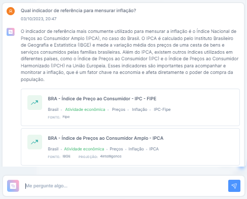
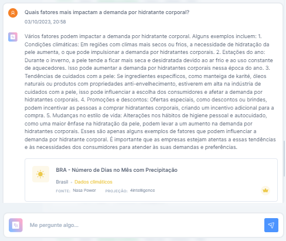
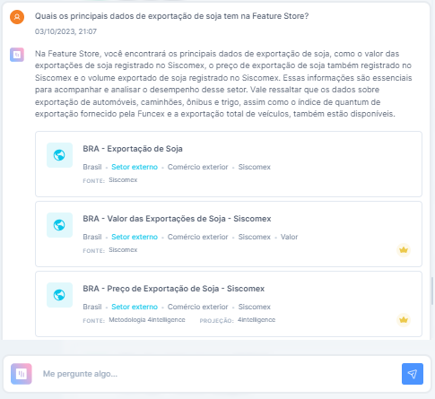
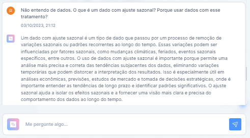

# Chat4i, a IA que conversa com você sobre dados

Nessa seção, vamos abordar o que é o Chat4i e como utilizá-lo para extrair insights para análises sobre o seu negócio, encontrar indicadores, e acessar conhecimentos técnicos de forma simples e dinâmica.

## O que é Chat4i?

O Chat4i é uma nova aplicação do ChatGPT voltada para inteligencia de dados e desenvolvida pela 4intelligence. Se você não acompanha os últimos desenvolvimentos da inteligencia artificial e não sabe o que é ChatGPT, nós explicamos.

O ChatGPT é como um computador que pode conversar com as pessoas. Ele usa a inteligência artificial para entender o que você diz e responder às suas perguntas de forma única, mesmo que sejam perguntas complexas. É como ter uma conversa com um assistente digital, que tem guardado na memória um mundo muito vasto de informações, permitindo que ele dialogue sobre assuntos diversos. Por exemplo, ele pode criar histórias, resolver equações matemáticas, escrever códigos, traduzir entre idiomas, fazer resumos, recomendações e muito mais.

Agora que você já sabe o que é ChatGPT e o que ele pode fazer, fica mais fácil entender o que é o Chat4i. A 4intelligence turbinou o treinamento do ChatGPT com toda a inteligência de dados da Feature Store para criar um poderoso assistente. Focado em te ajudar a encontrar os indicadores que você precisa para criar suas análises objetivas, o Chat4i recomenda dados para enriquecer suas análises e discorrendo obre relações e impactos, assim você entende porque os dados recomendados são relevantes.

Com o Chat4i, você não precisa ser especialista em economia brasileira para encontrar indicadores úteis. Na verdade, nem precisa saber quais indicadores são relevantes para seu mercado, apenas descrever o seu problema em uma pergunta.

## Como eu utilizo o Chat4i?

Você consegue utilizar o Chat4i da forma mais intuitiva possível, fazendo perguntas! Para cada pergunta, o Chat4i irá gerar uma resposta única e criar uma lista de indicadores, disponíveis na Feature Store, que representam os fatores e fenômenos citados nessa respota.

Lembre-se que o Chat4i é uma inteligência artificial orientada para conversar sobre dados! Não se frustre ao perguntar ao Chat4i qual é música favorita dele ou a receita do prato preferido dele, pois ele acertadamente irá indicar que não temos dados para responder essa pergunta.

## Quais perguntas posso fazer ao Chat4i?

**1) Encontre os indicadores que quantificam os fenômenos e fatores que você quer acompanhar**

-   Nem sempre sabemos como procurar pela informação que buscamos, ainda mais quando essa informação é um dado. Afinal, o mundo dos dados, principalmente dos dados econômicos, pode ser uma sopa de letrinhas, PIB, IPCA, Selic, IC-BR ... Veja como o Chat4i te ajuda a desembaralhar as letras!

**2) Explore indicadores que se conectam com seu negócio**

-   xxxxxxxxxxx

**3) Pesquise de uma forma mais dinâmica**

-   Se você já tem uma boa noção de quais são os fatores que mais afetam o seu negócio e quais indicadores quantificam esses fatores de forma objetiva, o Chat4i te ajuda a pesquisar focando setores e produtos específicos. Veja como o Chat4i te ajuda a descobrir quais dados nichados estão disponíveis!

**4) Tire dúvidas sobre transformações e tratamentos de indicadores**

-   Aproveite o dinamismo e conhecimento da nossa aplicação de inteligencia artificial para fazer perguntas mais específicas sobre termos técnicos do mundo da ciência de dados e estatística. Não deixe de utilizar uma informação valiosa porque você não entende como foi gerada e o que significa. Veja como o Chat4i te ajuda a entender termos técnicos e jargões!

Agora que você sabe tudo sobre o Chat4i, qual será sua próxima pergunta?
