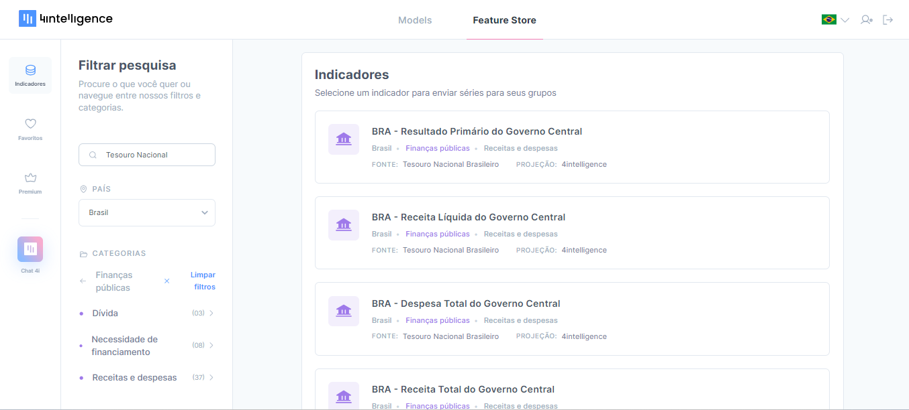
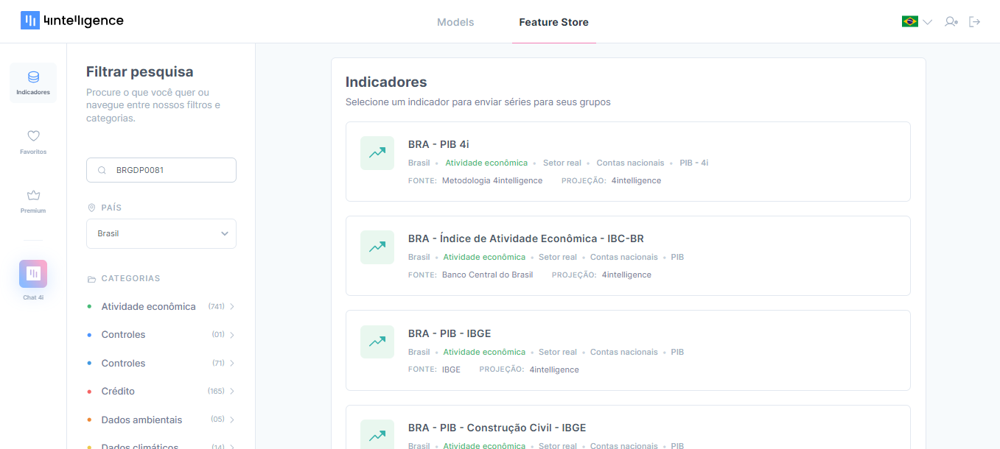

# Pesquisando por indicadores

Nessa seção, vamos abordar como você pode pesquisar por dados na Feature Store para encontrar os indicadores que você procura.

Caso você não tenha muita familiaridade com termos técnicos e siglas utilizadas para nomear cada indicador, sugerimos que comece a explorar a Feature Store a partir do Chat4i. O artigo anterior aborda como encontrar indicadores e acessar conhecimento técnico de forma simples e dinâmica utilizando o Chat4i.

Por outro lado, caso você já tenha uma boa ideia de qual indicador está procurando para incluir em suas análises baseadas em dados, há três formas de buscar por ele: (1) exploração das categorias, (2) pesquisar por palavras-chave e (3) pesquisar pelo código do indicador.

**1) Exploração das categorias**

-   Todos os dados da Feature Store estão organizados em categorias e subcategorias.

-   zzzzzzzzzzz

**2) Pesquisar por palavras-chave**

-   Para encontrar de forma rápida os indicadores que você procura na Feature Store, busque por palavras-chave que se relacionem com o nome do indicador. Você pode buscar por "Juros" para encontrar a [Taxa Selic](https://stg4ch.4casthub.ai/feature-store/indicators/BRINR0010), que é taxa de juros de referência da economia brasileira, ou pode buscar pela sigla "Selic", jargão popular entre os agentes do mercado.
-   Você também consegue utilizar a pesquisa para encontrar todos os indicadores que vêm da mesma fonte primária. No exemplo abaixo, procuramos todos os indicadores da categoria Finanças Públicas, cuja fonte primária é o Tesouro Nacional.

**3) Pesquisar pelo código do indicador**

-   Todo indicador da Feature Store possui um código único de nove dígitos que o identifica de forma exclusive. Esse código está visível na URL da página do indicador. Dê uma olhada nos últimos 9 caracteres que aparecem no na caixa de texto no topo do seu navegador, esse é o seu código.
-   Você consegue encontrar um indicador pesquisando pelo seu código. Por exemplo, para encontrar o [Produto Interno Bruto (PIB) com metodologia 4intelligence](https://4casthub.ai/feature-store/indicators/BRGDP0081) na Feature Store, digite 'BRGDP0081' na caixa de pesquisa. O indicador será o primeiro resultado da busca.

**Atenção**: A pesquisa é específica à categoria e ao país que você está navegando. Certifique-se de escolher corretamente esses dois campos antes de buscar por palavras-chave ou pelo código de 9 dígitos.
